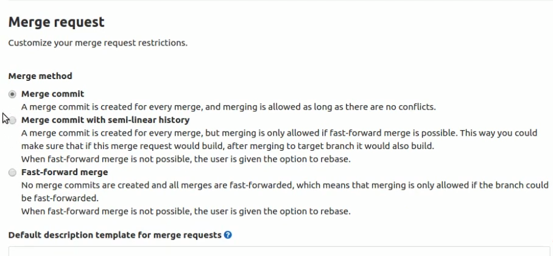

gitlab 仓库的 merge request 有三个配置选项：

 


+ 选项 1 (merge commit)，只有源分支会被测试，因此 master 上有被破坏的风险。
+ 选项 2 (Merge commit with semi-linear history)，除了测试源分支外，还会测试合并后的节点，因此 master 分支会比较安全，但是会浪费比较多的测试时间，同时开发人员需要进行 rebase。
+ 选项 3 (Fast-Forward merge) 的测试策略和第一第二是一样的

选项 2 和选项 3 只是生成的 commit history 会不同

以下的三个图，分别对应上面的三个选项生成的 commit history


选项 1 为 gitlab 的默认选项，选项 2 和选项 3 一般会要求开发人员 rebase，在 gitlab 上做了 merge request 的 rebase 后，如果还需要进一部在本地编辑。如果在本地分支 git pull 后会产生一个新的 merge commit 并可能会产生冲突。这个问题可以如下解决：

```
git checkout this_other_branch
git stash // Just in case you have local changes that would be dropped if you dont stash them
git fetch
git reset —-hard origin/this_other_branch
```

https://medium.com/@catalinaturlea/clean-git-history-a-step-by-step-guide-eefc0ad8696d

