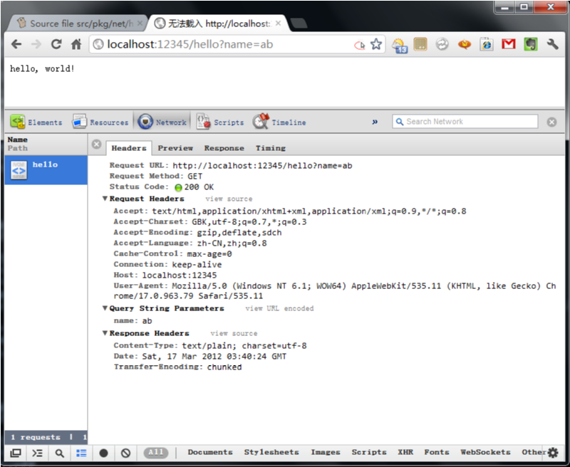

当我们在浏览器中输入一个地址，或者点击一个链接时，浏览器就会向Web服务
器发送一个Http Request请求，在 Chrome 中可以使用 `右键->审查元
素->Network`来查看 Http Request，需要在打开此窗口的情况下，刷新页面。另
外还可以在地址栏中输入: `chrome://net-internals/`来查看 http request。


## Request syntax
一个HTTP request由三个基础部分组成：
+ Request line
+ HTTP headers
+ Content
有三种 request headers：
+ General Headers
+ Request Headers
+ Entity Headers

Request Headers和一种包含和一个特定的HTTP Request请求相关的信息，比如
User-Agent。

General Headers中的内容理论上来说可以用在http request和http response中。

## Request Methods
There are eight request methods in HTTP/1.1: GET, POST, PUT, DELETE,
HEAD, TRACE, OPTIONS, and CONNECT. 

### The Get Method
A GET request traditionally contains no content and thus no entity headers.

``` 
GET /search?hl=en&q=HTTP&btnG=Google+Search HTTP/1.1 

//request headers
Host: www.google.com 
User-Agent: Mozilla/5.0 Galeon/1.2.0 (X11; Linux i686; U;) Gecko/20020326 
Accept: text/xml,application/xml,application/xhtml+xml,text/html;q=0.9, 
        text/plain;q=0.8, video/x-mng,image/png,image/jpeg,image/gif;q=0.2, 
        text/css,*/*;q=0.1 
Accept-Language: en 
Accept-Encoding: gzip, deflate, compress;q=0.9 
Accept-Charset: ISO-8859-1, utf-8;q=0.66, *;q=0.66 

//general headers
Keep-Alive: 300 
Connection: keep-alive
```

###  The POST Method

```
*request line*
POST /search HTTP/1.1 
```
## general header
```
Host: www.google.com 
User-Agent: Mozilla/5.0 Galeon/1.2.5 (X11; Linux i686; U;) Gecko/20020606 
Accept: text/xml,application/xml,application/xhtml+xml,text/html;q=0.9, 
        text/plain;q=0.8,video/x-mng,image/png,image/jpeg,image/gif;q=0.2, 
        text/css,*/*;q=0.1 
Accept-Language: en 
Accept-Encoding: gzip, deflate, compress;q=0.9 
Accept-Charset: ISO-8859-1, utf-8;q=0.66, *;q=0.66 
Keep-Alive: 300 
Connection: keep-alive 
```

## entity header
```
Content-Type: application/x-www-form-urlencoded 
Content-Length: 31 
```
## Content
```
hl=en&q=HTTP&btnG=Google+Search 
```
http://blog.csdn.net/mspinyin/article/details/6141638


## 使用 golang 的简单Web服务器
只是为了学习的目的，打印出接收的HTTP Request的内容,在浏览器中输入http://localhost:12345/hello 即可。

```golang
package main

import (
	"io"
	"net/http"
	"fmt"
	"os"
)

// 只是打印出WebRequest的Header

var G_COUNT = 0
func HelloServer(w http.ResponseWriter, req *http.Request) {
	fmt.Printf("\nReceive %d request\n\n", G_COUNT)
	G_COUNT++
	fmt.Printf("Method: %s\n", req.Method)
	fmt.Printf("URL: %s\n", req.URL)
	fmt.Printf("RequestURI: %s\n", req.RequestURI )
	fmt.Printf("Proto: %s\n", req.Proto)
	fmt.Printf("HOST: %s\n", req.Host) 

	fmt.Printf("\nHttp Request Header:\n\n")

	for k, vs := range req.Header{
		var values string
		for _, v := range vs{
			values += v
			values += " "
		}
		fmt.Printf("%s:%s\n", k, values)
	}
	io.WriteString(w, "hello, world!\n")
}

func main() {
	http.HandleFunc("/hello", HelloServer)
	err := http.ListenAndServe(":12345", nil)
	if err != nil {
		fmt.Printf("ERR: = %s", err)
		os.Exit(-1)
	}
}
```