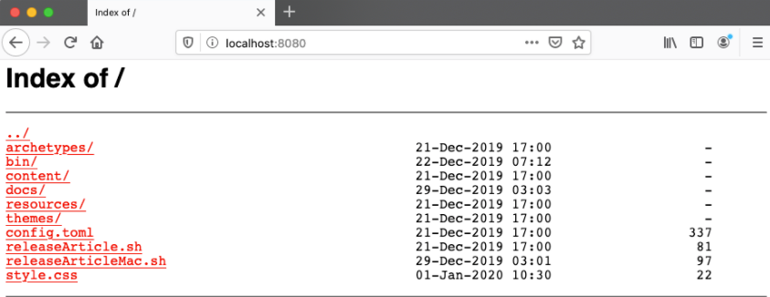

除了在 HTML 文档中 使用 Link 来加载 CSS 外，其实还可以使用 HttpHeader 中的 [Link](https://developer.mozilla.org/zh-CN/docs/Web/HTTP/Headers/Link) 字段：

```html
Link: </style.css>; rel=stylesheet;type=text/css
```

这个功能在一些不容易更改 html 内容的情况下，非常有用。可以通过 server 端，添加该 `http header` 来加载外部的 CSS，比如在 nginx 配置文件中使用如下 `add_header` 配置，就可以实现加载自定义的 CSS，从而达到定义 `nginx` 的 `autoindex` 页面外观的效果

```nginx
location / {
    root   /Users/bzhu/quickstart;
    autoindex on;
    add_header Link "</style.css>; rel=stylesheet;type=text/css";
}
```

加入 style.css 内容如下：

```css
a {
  color: red
}
```

可以实现如下的效果，链接的颜色有默认的蓝色，变成了红色




同时可以观察到，浏览器加载了对应的 CSS：


遗憾的是Chrome 还不支持该功能：

https://bugs.chromium.org/p/chromium/issues/detail?id=120104

https://bugs.chromium.org/p/chromium/issues/detail?id=58456

https://bugs.chromium.org/p/chromium/issues/detail?id=692359

https://bugs.chromium.org/p/chromium/issues/detail?id=19237