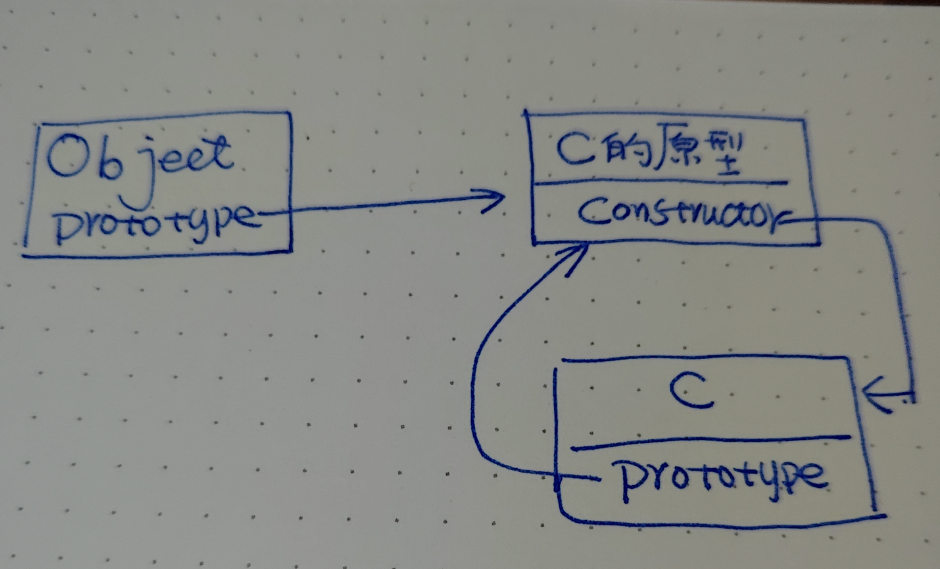

> The instanceof operator tests whether the prototype property of a constructor appears anywhere in the prototype chain of an object.

`object instanceof constructor`

`instance of` 的语义是：检查右边的函数的原型，是否存在于操作符左边的原型链上。


# 原型链

首先我们来理解一下原型链的意义：

假定我们有 `a`, `b` 和 `c` 三个 `object`

```
Object.setPrototypeOf(a, b);
Object.setPrototypeOf(b, c);
```

上面的代码就把 b 设置为了 a 的原型， c 设置为 b 的原型，因此 a 的原型指向 b，b 的原型指向 c。因此每一个对象都可以有自己的原型，每一个原型也可以拥有自己的原型，以次类推形成一个原型链。


a 在查找一个属性时，如果 a 本身没有此属性的情况下，会在他的原型对象上查找， 如果在原型  b 上还是没有找到，就到 b 的原型上查找。

# 构造函数与原型

在 JavaScript 中，够造原型的方式有很多种，但是使用构造函数来创建函数，是最经典的方法。

```
function C() {
	this.property = 1;
}

object = new Constructor();

```

在使用构造函数构造对象的时候，被构造对象的原型会设置为构造函数的原型。因此 `object` 的原型指向 `C` 的原型。另外，函数的原型通过 `constructor` 属性指向函数。因此形成了如下的原型链。很显然 函数`C` 的原型在 `object`的原型链上。因此

`object instance of C`  为 `true`





# 深入理解

事情远没有这么简单，以下是 [MDN](https://developer.mozilla.org/en-US/docs/Web/JavaScript/Reference/Operators/instanceof) 上的举例

比如：

```js
function C() {};
C.prototype = {};
o2 = new C();
o2 instanceof C; // true
```

在以上的例子中虽然我们在构造 `o2` 前更改了函数的原型，`o2` 在构造后还是会指向构造函数 `C` 的原型。因此 `o2 instance of C ` 为 `true`


```js
D.prototype = new C(); // add C to [[Prototype]] linkage of D
var o3 = new D();
o3 instanceof D; // true
o3 instanceof C; // true since C.prototype is now in o3's prototype chain
```

解释：o3 是有构造函数D 来构造的，因此 o3 的原型指向 D 的原型，D 的原型为 一个有C构造的对象，此对象的原型为C的原型（绕晕了没，哈哈）。因此 `o3 instanceof C`  成立


