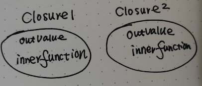

> Operationally, a closure is a record storing a function together with an environment.

闭包的概念很抽象，但是我们可以很简单的阐述如何创建一个闭包：

```javascript
function outerFunction() {
	let outValue;
	function innterFunction() {
		outValue = "assigned by closure";	
	}	
	return innerFunction;
}
closure1 = outerFunction(1)
closure2 = outerFunction(2)
```
在以上的代码中，当我们调用 `outerFunction()` 时， 闭包就生成了。`cloure1` 和 `clousre2` 就是两个闭包，虽然它们指向同一个内部函数。但是却拥有各自的 `outValue`。 在我们这个例子中， 闭包环境中只有一个变量`outValue`。因此闭包就像一个魔法气泡一样，把与其相关的执行环境包裹了起来，因此各个闭包互相独立。

由于 `closure1` 和 `clousre2` 各自拥有自己的状态`outvalue`，因此两者可以互不影响。

举个🌰：

在 DOM 编程中， `closure1` 和 `cloure2` 可以为两个不同按钮的 `click` 函数。这样两个按钮的状态可以互不影响，同时工作。

比如，稍加变化后的代码，就可以用于记录两个按钮的点击次数

```html
<!DOCTYPE html>
<html lang="en">
<head>
</head>
<body>
    <button type="button" id="button1">Click Me!</button>
    <button type="button" id="button2">Click Me!</button>
</body>
<script>
function outerFunction(arg) {
	let outValue = 0;
	function innerFunction() {
        outValue++;	
        console.log("You clicked me " + outValue + "times!");
	}	
	return innerFunction;
}

let closure1 = outerFunction();
let closure2 = outerFunction();
document.getElementById("button1").addEventListener("click", closure1);
document.getElementById("button2").addEventListener("click", closure2);
</script>
</html>
```

因此，闭包就是一个内部函数，加上与其相关的变量环境，这些内容像被一个魔法气泡包裹一样，这样就形成了一个闭包。




参考：
JavaScript 忍者编程第二版 5.2 节


