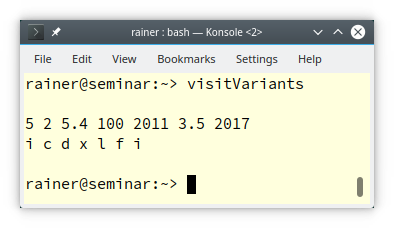
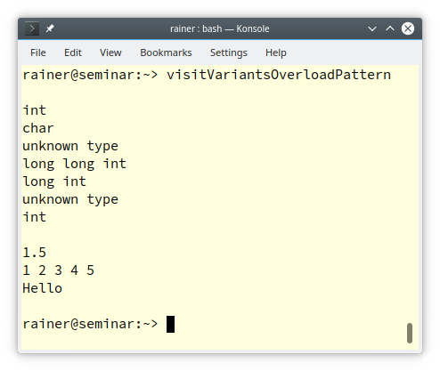
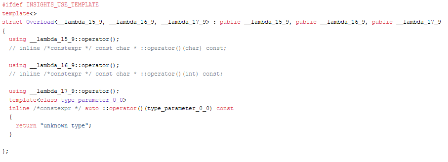
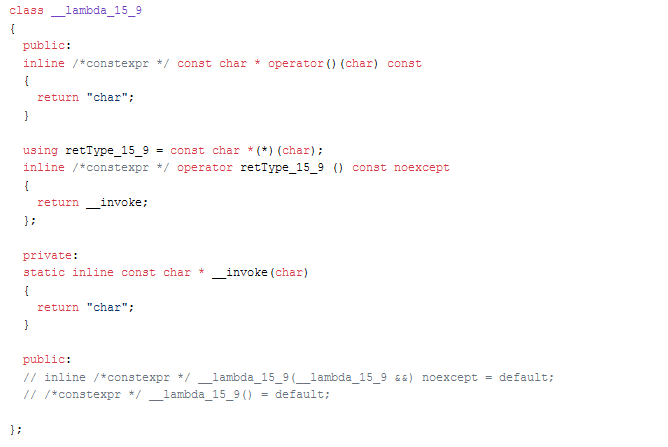

窗外阴雨连绵，闲来无事就看一片文章吧。翻译自 [Visiting a std::variant with the Overload Pattern](https://www.modernescpp.com/index.php/visiting-a-std-variant-with-the-overload-pattern)

一般来说，你可以使用 `std::variant` 的 `overload` 模式。`std::varian`是类型安全的 `union`。`std::variant`(C++17)只有一个属于其中一个类型的值。`std::variant`允许你对它使用 `visitor`。本文手把手演示如何使用 `overload` 模式

我在我的另一片文章[Smart Tricks with Parameter Packs and Fold Expressions](https://www.modernescpp.com/index.php/smart-tricks-with-fold-expressions)中介绍了如何借助于一组 lambda 来使用 `overload` 模式。`overload` 模式经常被用来访问`std::variant ` 中的值

我知道在我的C++课程的学员中，许多人都不知道`std::variant`和 `std::visit`而是直接只用`union`。因此，本文算是对 `std::variant` 和 `std::visit` 的一个提醒


## `std::variant` C++ 17

`std::variant`是类型安全的 `union` 。 一个 `std::variant` 的实例包含一个其中一个类型的值。这个值不能是引用，C 的数组或者 `void`。一个 `std::variant`可以最多包含一个类型。`std::variant`默认初始化为其中的第一个类型。在这种情况下，第一个类型必须有一个默认的构造函数。下面是一个来自于 `cppreference.com` 的一个例子

```C++
// variant.cpp

#include <variant>
#include <string>
 
int main(){

  std::variant<int, float> v, w;
  v = 12;                              // (1)
  int i = std::get<int>(v);
  w = std::get<int>(v);                // (2)
  w = std::get<0>(v);                  // (3)
  w = v;                               // (4)
 
  //  std::get<double>(v);             // (5) ERROR
  //  std::get<3>(v);                  // (6) ERROR
 
  try{
    std::get<float>(w);                // (7)
  }
  catch (std::bad_variant_access&) {}
 
  std::variant<std::string> v("abc");  // (8)
  v = "def";                           // (9)

}
```

我定义了两个 `std::variant` 变量 `v` 和 `w`。他们可以包含 `int` 或者 `float`的值。他们的默认值是0。 `v`被赋值为 12（1）。 `std::get<int>(v)` 返回其中的值。在（2）（3）你可以看到把 `v` 赋值给 `w`的方法。但是有几个原则需要注意。你可以使用类型来获取`std::variant`的值（5），也可以使用索引来获取其中的值(6)。但是使用的类型和索引需要要是有效的。在（7），`w`拥有一个 `int` 的值，因此系统会抛出 `std::bad_variant_access` 异常。如果构造和赋值操作不明确的话，将会发生隐式转换。这也是为什么可以使用一个 `C-String` 赋值给 `std::variant<std::string>`（9)

当然还有更多的关于 `std::variant`可以阅读 Bartlomiej Filipek 的文章[Everything You Need to Know About std::variant from C++17](https://www.cppstories.com/2018/06/variant/)

谢谢 `std::variant`提供的功能，C++ 17 提供了方便的方法来访问 `std::variant`中的值

## `std::visit`

`visitor` 模式对于`std::variant`，这种经典的设计模式有点像对于容器的 `visitor`

`std::visit`允许你对于容器中的 `std::variant`使用 `visitor` 模式。`visitor`必须是可以调用的。可以调用意味着你可以调用他（invoke)。一般可以调用的都是函数，函数对象或者 `lambda`表达式。在下面的例子中我使用 `lambda`
```C++
// visitVariants.cpp

#include <iostream>
#include <vector>
#include <typeinfo>
#include <variant>

  
int main(){
  
    std::cout << '\n';
  
    std::vector<std::variant<char, long, float, int, double, long long>>      // 1
               vecVariant = {5, '2', 5.4, 100ll, 2011l, 3.5f, 2017};
  
    for (auto& v: vecVariant){
        std::visit([](auto arg){std::cout << arg << " ";}, v);                // 2
    }
  
    std::cout << '\n';
  
    for (auto& v: vecVariant){
        std::visit([](auto arg){std::cout << typeid(arg).name() << " ";}, v); // 3
    }
  
    std::cout << "\n\n";
  
}
```

我在（1）创建了一个 `std::variant`的容器并且初始化。每一个 `std::variant`可以拥有一个 `char, long, float, int, double`或者 `long long`。使用 `lambda` 遍历着个容器中的值非常方便（2）（3）。首先我打印了其中的每个值，然后使用 `typeid(arg).name()` 我可以打印出每个值对应的类型



这样很好吗？不！我在上面的代码中使用了一个 `generic lambda`。正因为此，gcc 生成的类型的字符串，可读性不高。老实说我想使用针对每一个类型的 `lambda` 来处理每一种类型。着正是使用 `overload` 模式的好时机

## `overload`模式
```C++
// visitVariantsOverloadPattern.cpp

#include <iostream>
#include <vector>
#include <typeinfo>
#include <variant>
#include <string>

template<typename ... Ts>                                                 // (7) 
struct Overload : Ts ... { 
    using Ts::operator() ...;
};
template<class... Ts> Overload(Ts...) -> Overload<Ts...>;

int main(){
  
    std::cout << '\n';
  
    std::vector<std::variant<char, long, float, int, double, long long>>  // (1)    
               vecVariant = {5, '2', 5.4, 100ll, 2011l, 3.5f, 2017};

    auto TypeOfIntegral = Overload {                                      // (2)
        [](char) { return "char"; },
        [](int) { return "int"; },
        [](unsigned int) { return "unsigned int"; },
        [](long int) { return "long int"; },
        [](long long int) { return "long long int"; },
        [](auto) { return "unknown type"; },
    };
  
    for (auto v : vecVariant) {                                           // (3)
        std::cout << std::visit(TypeOfIntegral, v) << '\n';
    }

    std::cout << '\n';

    std::vector<std::variant<std::vector<int>, double, std::string>>      // (4)
        vecVariant2 = { 1.5, std::vector<int>{1, 2, 3, 4, 5}, "Hello "};

    auto DisplayMe = Overload {                                           // (5)
        [](std::vector<int>& myVec) { 
                for (auto v: myVec) std::cout << v << " ";
                std::cout << '\n'; 
            },
        [](auto& arg) { std::cout << arg << '\n';},
    };

    for (auto v : vecVariant2) {                                         // (6)
        std::visit(DisplayMe, v);
    }

    std::cout << '\n';
  
}
```
（1）创建了一个包含很多 `std::variant` 的容器，（4）创建了更为复杂类型的容器

对于 `vecVariant`，`TypeOfIntegral`返回每一种类型的字符串形式。如果类型没有包含在 `TypeOfIntegral`中就会返回`unkown type`。（3）我使用了上面定义的 Overload 和 `std::visit` 来访问容器中的每一个 `std::variant`

第二个 `variant` `vecVaraint2`包含了组合类型。我创建了另外一个 `overload` 来打印其中的每个值。一般来说我可以把每一个值推到 `std::cout`。但是对于 `std::vector<int>`，我使用了 `range-based-for-loop`把每一个值推向 `std::cout`

最终，下面就是这个程序的输出




关于 `overload` 模式我还有点要说的。在我的另一片文章中也有介绍 [Smart Tricks with Parameter Packs and Fold Expressions](https://www.modernescpp.com/index.php/smart-tricks-with-fold-expressions)

```C++
template<typename ... Ts>                                  // (1)
struct Overload : Ts ... { 
    using Ts::operator() ...;
};
template<class... Ts> Overload(Ts...) -> Overload<Ts...>; // (2)
```

(1) 处是 `overload` 模式，(2) 是对它的 `deduction guide`。结构体 `Overload` 可以有任意数量的基类。它 public 继承了每一个类，并且把每一个基类的(`Ts::operation...`)引入自己的类型。每一个基类都需要有 call operator（即是可调用的)。Lambda 提供了 call operator。下面是简化的代码

```C++
#include <variant>

template<typename ... Ts>                                                 
struct Overload : Ts ... { 
    using Ts::operator() ...;
};
template<class... Ts> Overload(Ts...) -> Overload<Ts...>;

int main(){
  
    std::variant<char, int, float> var = 2017;

    auto TypeOfIntegral = Overload {     // (1)                                  
        [](char) { return "char"; },
        [](int) { return "int"; },
        [](auto) { return "unknown type"; },
    };
  
}
```

使用 C++ Insights 可以观察上面的代码发生了什么。首先 （1） 会生成如下的特化类模版



另外，在 overload 模式中使用的 lambda 比如```[](char){ return "char"; }``` 会生成一个函数对象。在这种情况下，编译器生成的函数对象的名字为：`__lambda_15_9`



上面自动生成的类型有一个有趣的点，`__lambda_15_9` 的 `call operator`被 overloaded 为 `char: const char* operator()(char) const { return "char"; }`

`deducatio guide` `template<class... Ts> Overload(Ts...) -> Overload<Ts...>;`(2) 仅仅 C++ 17 需要。`deduction guide`告诉编译器如何生成构造函数之外的类型参数。C++ 20 可以自动做到


